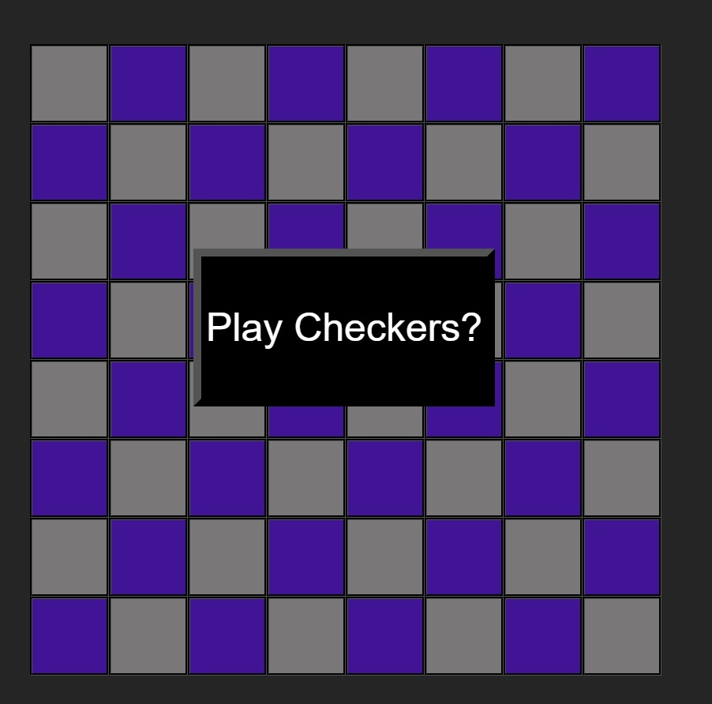
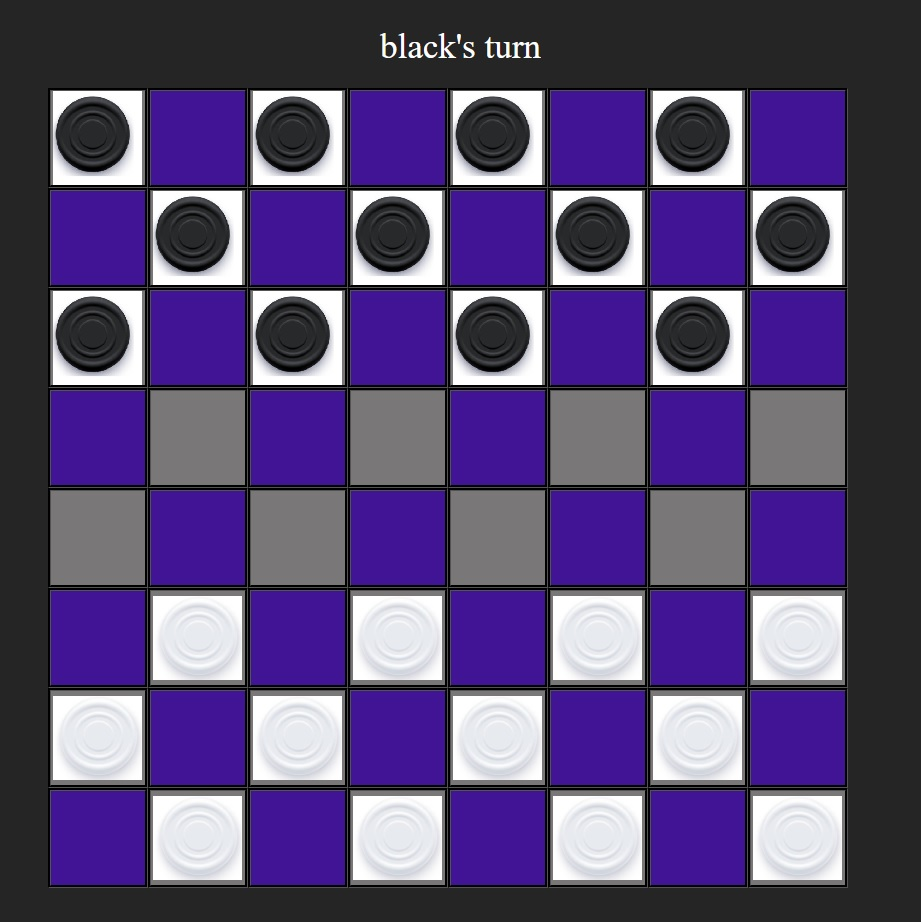
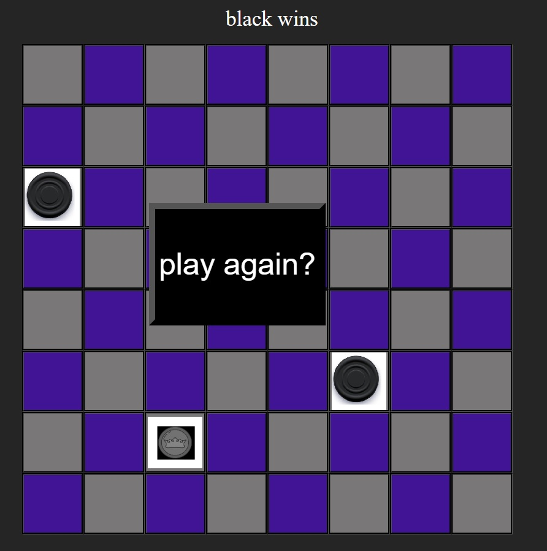
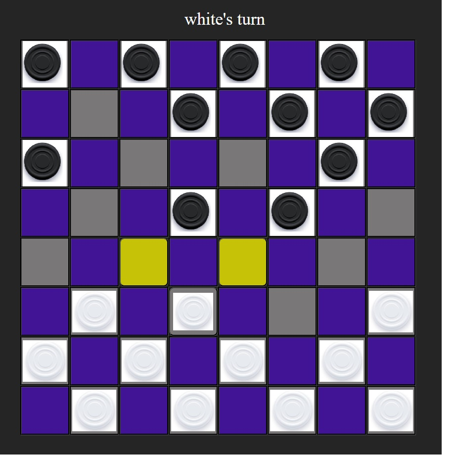
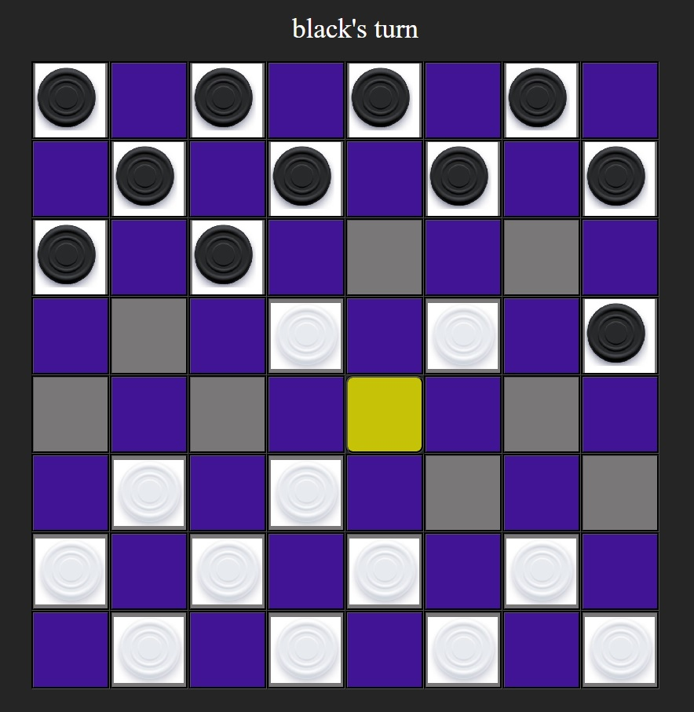
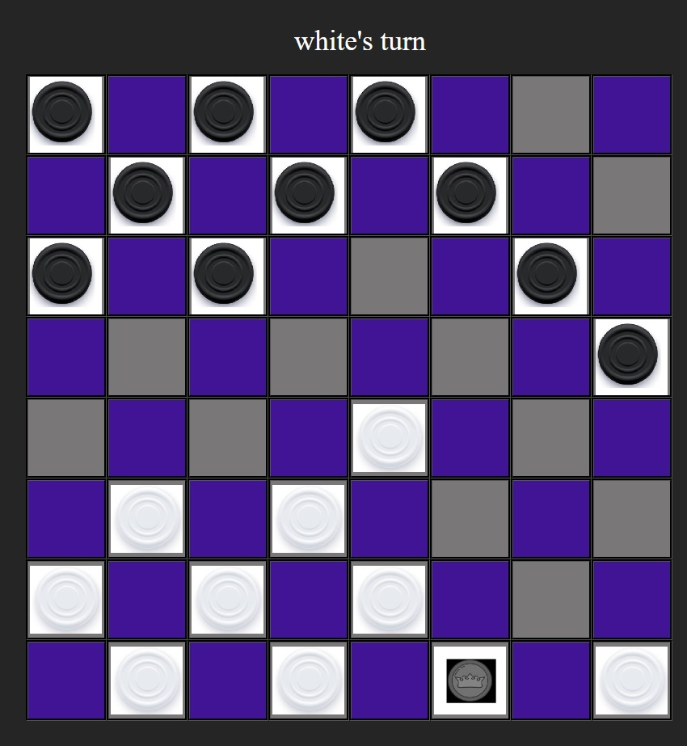

# Checkers  

### Play a classic game of checkers locally against a friend!  
### [Play the Game Here!](https://mdfasano.github.io/checkers/)
> Click on a checkers piece to see where it can be moved, then click on the tile you would like to move it to.  
> See the rules section below for a detailed description of the rules of the game!
---

## Technologies Used
-HTML  
-CSS  
-Javascript  
-Figma

##  Game Rules
### Basics
- This is a two player game.
- One player controls *color1*, the other controls *color2*.
- *Color1* moves first  
- Pieces can only move diagonally.
- Basic pieces may not move backwards.
- Pieces cannot move onto occupied tiles. 
- Players may capture opponents pieces (explained below).  
- Players may upgrade their own pieces (explained below).  
### Capturing
- A captured piece is removed from the field of play
- After a capture, the capturing piece must move to the space immediately after and in a straight diagonal line starting at the capturing piece and drawn through the captured piece.
- After a capture, the active player **may** choose to continue their turn if the capturing piece is able to make another capture
    - The player may not make any non-capturing moves.
    - The player may only capture using the piece that made the initial capture.
- A player piece may capture an opposing piece if and only if:
    - There exists an opposing piece in a location to which the players piece can legally move.
    - The capturing piece has a valid space to move to after capturing
### Upgrading
- If any player's piece lands on the opponants back row, that piece must be upgraded to a Leader .
- A player can have any number of Leaders .
- Leader pieces can move both backwards and forwards.
- If a Leader is created after capturing an opponents piece, that Leader remains active and **may** choose to continue capturing pieces.

## Game Images
### Starting Screen
  
### Starting Board State

### Winning the Game

### Example of a Piece being selected to move

### Capture example

### King example

## Additional features and future enhancements
- Improve art elements
- add a highlight to a piece when it is selected for movement
- adjust styling for a range of screen sizes
- AI
- Turn timers
- sound effects for making a move and making a capture
- move animations
- online connected play
- ability for players to choose board colors and piece colors