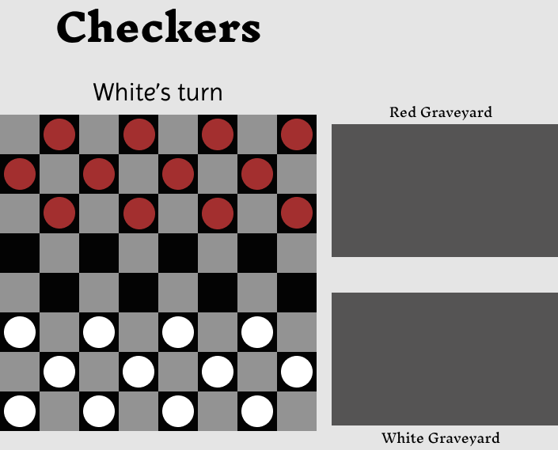
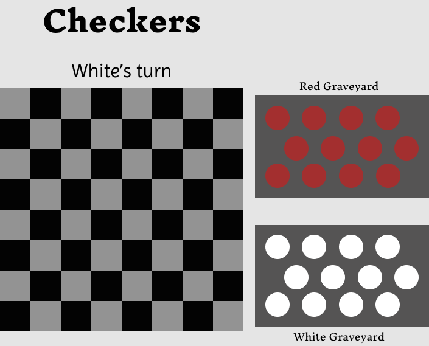

# Checkers  

### Play a classic game of checkers locally against a friend!  

---
  
    

## Wireframes
[Figma Wireframing](https://www.figma.com/file/MQPcEbOaNF7M5grqDCnSnR/Checker-Board-(Community)?type=design&node-id=205%3A55&mode=design&t=gpYJ8cH4oqCSpRHW-1)   
### Start of game setup
  
### Full graveyard
  
---
## Technologies Used
-HTML  
-CSS  
-Javascript  

##  Game Rules
### Basics
- This is a two player game.
- One player controls *color1*, the other controls *color2*.
- *Color1* moves first  
- Pieces can only move diagonally.
- Basic pieces may not move backwards.
- Pieces cannot move onto occupied tiles. 
- Players may capture opponents pieces (explained below).  
- Players may upgrade their own pieces (explained below).  
### Capturing
- A captured piece is removed from the field of play
- After a capture, the capturing piece must move to the space immediately after and in a straight diagonal line starting at the capturing piece and drawn through the captured piece.
- After a capture, the active player **may** choose to continue their turn if the capturing piece is able to make another capture
    - The player may not make any non-capturing moves.
    - The player may only capture using the piece that made the initial capture.
- A player piece may capture an opposing piece if and only if:
    - There exists an opposing piece in a location to which the players piece can legally move.
    - The capturing piece has a valid space to move to after capturing
### Upgrading
- If any player's piece lands on the opponants back row, that piece must be upgraded to a Leader .
- A player can have any number of Leaders .
- Leader pieces can move both backwards and forwards.
- If a Leader is created after capturing an opponents piece, that Leader remains active and **may** choose to continue capturing pieces.
## User Story
**As a player I want to:**
- be shown a 8x8 checkered playing board.
- have 12 pieces set up for each player on dark tiles.
    - each player's pieces starting on opposite sides of the board.
- have the current players turn displayed.
- have movable pieces lightly highlighted.
- be able to select a piece to move by clicking on it
    - recieve light feedback if an ineligable piece is clicked
    - while a piece is selected, I want to see light highlighting of spaces to which it can be moved
    - be able to deselect a piece by clicking elsewhere in the window
        - without receiving an error for unviable clicks
        - should still be able to select my viable pieces without having to click twice
    - be able to move a piece by selecting a viable tile to move to
        - I want to see feedback for what I am about to click on while hovering my mouse over it
    - be able to capture opponents pieces and see them removed from the board
    - be able to upgrade to a leader
        - see visual indication of which pieces are leaders
- have the turn automatically transition to the next player when the active player has no viable actions left
- see a winner displayed on the screen once a player has no possible moves to make on their turn
## Psuedocode
## Possible Additional Features
- AI
- Turn timers
- sound effects for making a move and making a capture
- move animations
- online connected play
- ability for players to choose board colors and piece colors